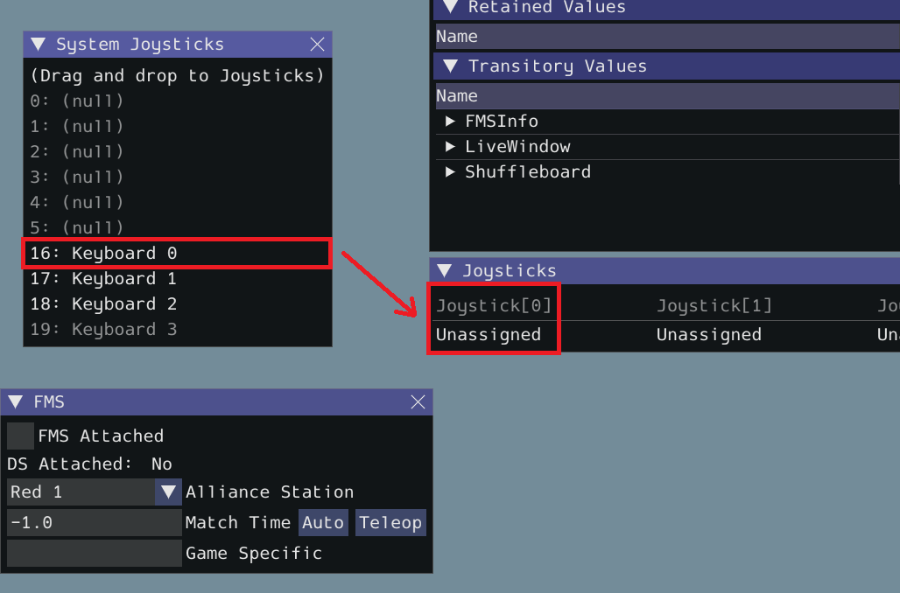

Un *joystick* (manette de jeu) peut être utilisé pour contrôler le robot à 
distance. On le branche dans l'ordinateur qui est connecté au robot. On 
peut en brancher jusqu'à 6.

On peut lire 3 types de valeur sur un *joystick* :

- Axe : un nombre à virgules (*float*) entre `-1` et `1`.
- Bouton : un booléen (`True` ou `False`) s'il est appuyé ou non.
- POV : angle entre `0` et `345` degrés ou `-1` si non appuyé.

On utilise la classe `wpilib.Joystick` pour accéder
aux valeurs de n'importe quel *joystick* générique.

---

Regarde
[l'exemple qui utilise wpilib.Joystick](file://Actuateurs/01_joysticks/exemple_joystick.py) et essaie-le en 
simulation ([voir la leçon](course://Bases/03_simuler)).

Pour connecter un *joystick* au bon port en simulation, il faut **cliquer** 
dessus et le **glisser** de la gauche vers le port souhaité.

Si tu n'as pas de *joystick* physique à connecter, tu peux utiliser le clavier
(cela n'est pas possible avec le vrai robot). Par exemple, avec *Keyboard 0*,
on utilise les axes principaux (X gauche-droite et Y bas-haut) avec les 
touches WASD. Les 4 boutons correspondent aux touches ZXCV.

---

Si on a une manette Xbox, on peut plutôt  utiliser la classe `wpilib.
XboxController`.  Elle comporte plusieurs méthodes spécialisées :

- au lieu de `getRawAxis(num)`, il y a `getLeftX()`, `getLeftY()`, `getRightX
()`, `getRightY()`...
- au lieu de `getRawButton(num)`, il y a `getAButton()`, `getBButton()`, 
  `getXButton()`, `getYButton()`...

---

Regarde
[l'exemple qui utilise wpilib.XboxController](file://Actuateurs/01_joysticks/exemple_xbox.py)
et essaie-le en simulation ([voir la leçon](course://Bases/03_simuler)).

Remarque que les axes Y sont habituellement inversés (haut = -1, bas = 1). 
Il faut donc inverser la valeur en la multipliant par -1.

---

[Ta tâche](file://Actuateurs/01_joysticks/task.py)

- Dans `robotInit`, déclarer :
    - une manette Xbox branché sur le port 0 ;
    - le moteur gauche de la base pilotable, de type `PWMSparkMax`, sur le 
      port PWM 0 ;
    - le moteur droit de la base pilotable, de type `PWMSparkMax`, sur le 
      port PWM 1 ;
- Dans `teleopPeriodic`:
    - la base pilotable (moteurs gauche et droit) doivent avancer et reculer 
      ensemble en fonction de la valeur du *stick* gauche de la manette (si 
      j'avance un peu le *stick*, la base avance un peu ; si je l'avance 
      beaucoup, elle avance très vite ; si je le pointe vers l'arrière, la 
      base recule ; etc.) ;
    - en appuyant sur le bouton B, faire tourner rapidement la base 
      pilotable sur elle-même dans le sens horaire ;
    - en appuyant sur le bouton X, faire tourner rapidement la base 
      pilotable dans le sens antihorare.

  Pour faire tourner une base pilotable sur elle-même, il faut qu'un côté 
avance et que l'autre recule avec la même force.

