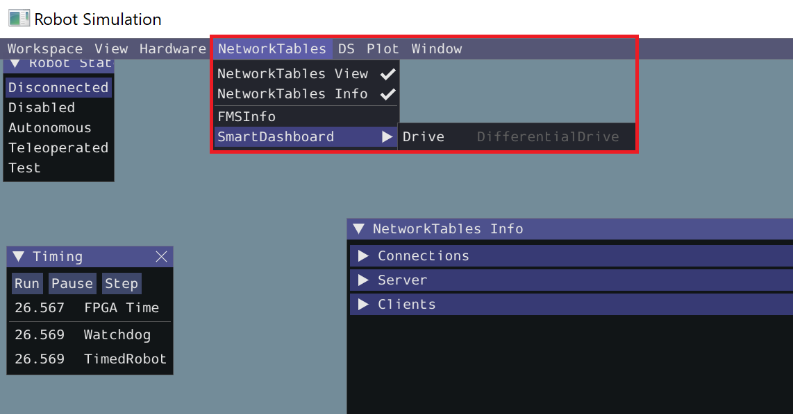

Les classes du package `wpilib.drive` rendent plus simple et intuitif le 
contrôle de la base pilotable du robot. 

Premièrement, on doit choisir la classe selon le type de base pilotable. Le 
type de base le plus simple est *DifferentialDrive*, aussi appelé *tank drive* 
(les côtés gauche et droit sont indépendants, mais les roues de chaque côté 
sont liées ensemble).

[Source](https://docs.wpilib.org/fr/stable/docs/software/hardware-apis/motors/wpi-drive-classes.html)

Un objet `DifferentialDrive` se crée à partir de 2 moteurs (gauche et 
droit) créés au préalable.

---

Regarde [l'exemple](file://Actuateurs/02_drive/exemple_drive.py)
et démarre la simulation.

N'oublie pas...
- d'associer le *joystick* ;
- d'afficher *PWM Outputs* ;
- de démarrer mode *Teleoperated*.

Tu peux remarquer dans l'exemple qu'on ajoute la `drive` sur le 
`SmartDasboard`. C'est facultatif, mais cela nous permet de visualiser le 
comportement de l'objet, autant en simulation que sur le vrai robot. On peut 
faire cela avec (presque) n'importe quel objet créé par WPILib.

Pour voir l'objet `drive`, clique sur l'onglet *NetworkTables*, va dans la 
section *SmartDashboard*, puis clique sur l'objet à afficher. 

---

[Ta tâche](file://Actuateurs/02_drive/task.py)

- Inverser le moteur droit (port PWM 1)
- Compléter la création de la `DifferentialDrive`
- Corriger le `teleopPeriodic` pour que la base se déplace dans le bon sens