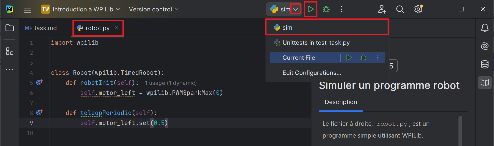
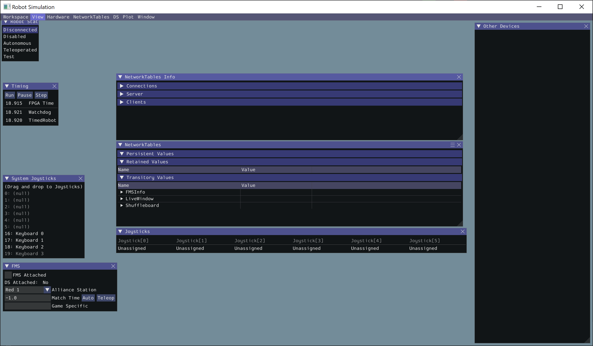
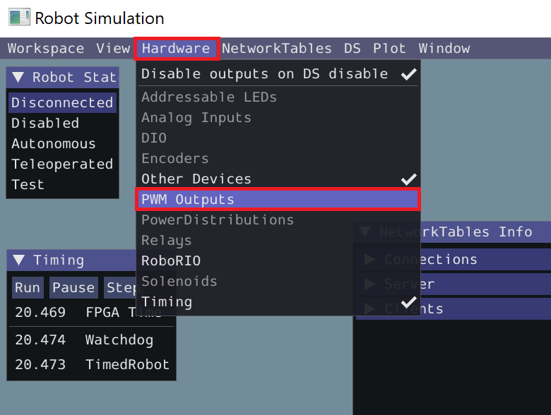
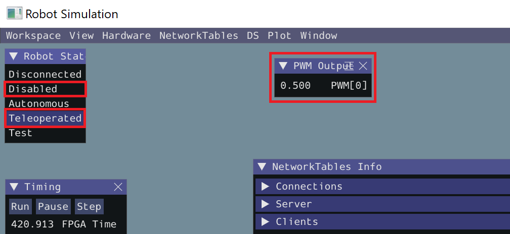

Le fichier `robot.py` à gauche est un programme simple utilisant WPILib.

1. La ligne `import wpilib` importe la librairie et permet de l'utiliser plus loin dans le programme.
2. Dans la fonction `robotInit`, on déclare les composantes de notre robot.
Ici, il s'agit d'un moteur `PWMSparkMax` connecté sur le port PWM 0.
Remarque que la variable `motor_left` est stocké dans `self` (le robot),
pour que la variable continue d'exister dans les autres fonctions ci-dessous.
3. Dans la fonction `teleopPeriodic`, le moteur est activé à 50 % (`0.5`). 

Le robot est toujours dans l'un des modes suivants :

| Mode         | Description                                                                           |
|--------------|---------------------------------------------------------------------------------------|
| Disconnected | L'ordinateur ne communique pas avec le robot.                                         |
| Disabled     | L'ordinateur est connecté au robot, mais le robot est désactivé.                      |
| Autonomous   | Le robot est en mode autonome.                                                        |
| Teleoperated | Le robot est en mode téléopéré (contrôlé à distanc par un pilote).                    |
| Test         | Peu utilisé. Ce mode permet d'essayer des composantes du robot sans exécuter le code. |

On pourrait donc ajouter à notre code d'autres fonctions qui correspondent aux différents modes
(`autonomousInit`, `autonomousPeriodic`...), mais ce n'est pas nécessaire pour le moment. 

Pour exécuter le programme, on peut le déployer dans un vrai robot, mais ce n'est pas très pratique.
On peut, à la place, le simuler sur notre propre ordinateur, ce qui est beaucoup plus pratique !

Pour ce faire :

1. Vérifie que le fichier `robot.py` est sélectionné.
2. Vérifie que la configuration `run` est sélectionnée.
3. Appuie sur le bouton **Run** (▶️ vert) pour démarrer la simulation.

La fenêtre suivante devrait s'afficher. 

Testons notre code robot.

1. Pour afficher les sorties PWM, ouvre l'onglet *Hardware*, puis clique sur *PWM Outputs*.

2. Dans la fenêtre *Robot State*, en haut à gauche, clique sur *Teleoperated*. Le moteur devrait afficher une valeur de `0.5`.

3. Dans la fenêtre *Robot State*, clique sur *Disabled*. Le moteur devrait revenir à `0`.

4. Quant tu as terminé, ferme la fenêtre ou clique sur le bouton *Stop* (⏹️ rouge) à coté du bouton *Run* dans PyCharm.

---

As-tu russi à voir la valeur de `0.500` dans le simulateur ?
